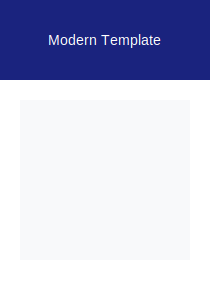

# Assignment Cover Generator 📝

[](https://opensource.org/licenses/MIT)
[](https://developer.mozilla.org/en-US/docs/Web/HTML)
[](https://developer.mozilla.org/en-US/docs/Web/CSS)
[](https://developer.mozilla.org/en-US/docs/Web/JavaScript)
[](https://github.com/ajnish-kumar-sahu/assignment-cover-generator/graphs/commit-activity)

> A modern, premium web application for generating professional academic assignment cover pages. Features glassmorphism UI, interactive particle backgrounds, 7 templates, 3-mode auto theme, and one-click PDF/JPG export — all built with vanilla HTML, CSS & JavaScript.

## 🌟 Overview

The Assignment Cover Generator helps students create polished, professional assignment covers in minutes. Fill in your details, pick a template and color, then export as PDF or JPG — no installs, no accounts, completely free.



## 📑 Templates (7)

| # | Template | Description |
|---|----------|-------------|
| 📜 | **Classic** | Traditional academic layout with formal header/footer sections |
| 🔷 | **Modern** | Contemporary design with dynamic color accents and clean lines |
| ◻️ | **Minimal** | Simplified, distraction-free — perfect for technical reports |
| 🏛️ | **Professional** | Business-style formatting for corporate/professional submissions |
| ✨ | **Elegant** | Refined design with decorative elements and premium typography |
| 🎨 | **Creative** | Bold, artistic layout with unique visual hierarchy |
| 🎓 | **Academic** | Institution-focused design with structured academic formatting |

Switch templates by clicking cards, using **← →** arrow keys, or swiping on mobile.

## 🎨 Theme Colors (7)

<table>
  <tr>
    <td>🔵 Default Blue</td>
    <td>🟢 Forest Green</td>
    <td>🔴 Ruby Red</td>
    <td>🟣 Royal Purple</td>
  </tr>
  <tr>
    <td>⚫ Classic Black</td>
    <td>🌊 Ocean Blue</td>
    <td>🟠 Deep Orange</td>
    <td></td>
  </tr>
</table>

## ✨ Key Features

### � 3-Mode Auto Theme
- **Auto** — Detects system preference (`prefers-color-scheme`), falls back to time-based (dark after 7 PM, light at 6 AM)
- **Light** — Forces light mode
- **Dark** — Forces dark mode
- Cycles via floating toggle button or `Ctrl+T`

### 🌌 Interactive Particle Background
- 60 multi-color particles with glow effects and pulse animation
- Mouse repulsion — particles scatter when you hover near them
- Connection lines drawn between nearby particles
- Color palette adapts to light/dark theme

### 💾 Smart Data Management
- **Auto-save** every 30 seconds
- Manual save/load with `Ctrl+S` / `Ctrl+L`
- Data stored securely in browser localStorage
- Form validation with real-time feedback

### � Export Options
- **PDF** — High-quality A4 export using jsPDF + html2canvas
- **JPG** — Universal image format for sharing
- **Print** — Direct printing with optimized print styles

### 💎 Premium UI/UX
- Glassmorphism design with backdrop blur
- Animated gradient backgrounds
- Staggered entrance animations for form fields
- Glowing pulse effect on active template card
- Button ripple effects
- Responsive design — works on desktop, tablet & mobile

## ⌨️ Keyboard Shortcuts

| Shortcut | Action |
|----------|--------|
| `Ctrl + Enter` | Generate cover page |
| `Ctrl + S` | Save form data |
| `Ctrl + L` | Load saved data |
| `Ctrl + T` | Toggle theme (Auto → Light → Dark) |
| `Ctrl + H` | Show help guide |
| `Ctrl + R` | Reset form |
| `Ctrl + P` | Print cover |
| `← / →` | Switch templates |
| `Esc` | Close modals |

## 🚀 Getting Started

### Prerequisites

- Modern web browser (Chrome 88+, Firefox 85+, Safari 14+, Edge 88+)
- JavaScript enabled

### Installation

1. **Clone the repository**
   ```bash
   git clone https://github.com/ajnish-kumar-sahu/assignment-cover-generator.git
   cd assignment-cover-generator
   ```

2. **Open in browser**
   ```
   Open main.html in your browser — no build step required!
   ```

### Usage

1. Open `main.html` → click **Assignment Cover Generator**
2. Fill in your assignment details (name, roll no., semester, subject, etc.)
3. Choose a template and theme color
4. Preview updates in real-time on the right panel
5. Click **Generate** or press `Ctrl+Enter`
6. Export as **PDF**, **JPG**, or **Print** directly

## 💻 Tech Stack

| Technology | Purpose |
|-----------|---------|
| HTML5 | Page structure & semantic markup |
| CSS3 | Glassmorphism, animations, responsive layout |
| Vanilla JavaScript (ES6+) | App logic, template rendering, theme system |
| [html2canvas](https://html2canvas.hertzen.com/) | HTML to canvas conversion for export |
| [jsPDF](https://github.com/parallax/jsPDF) | PDF generation |
| [Font Awesome 6.5](https://fontawesome.com/) | Icons |
| [Google Fonts (Inter)](https://fonts.google.com/specimen/Inter) | Typography |
| localStorage | Data persistence |

## 📁 Project Structure

```
assignment/
├── main.html              # Landing page — tool selector
├── index.html             # Assignment Cover Generator (main app)
├── Design-IndexPage.html  # Index Page Designer tool
├── website.html           # How to Use — help & guide page
├── app.js                 # Core app logic (particles, themes, templates, export)
├── styles.css             # Premium stylesheet (glassmorphism, animations)
├── thumbs/                # Template preview thumbnails
├── README.md              # This file
├── LICENSE                # MIT License
└── SECURITY.md            # Security policy
```

## 🌐 Browser Support

| Browser | Supported |
|---------|------------------|
| Chrome  | 88+ |
| Firefox | 85+ |
| Safari  | 14+ |
| Edge    | 88+ |
| Mobile Chrome | Android 8+ |
| Mobile Safari | iOS 13+    |

## 👨‍💻 Developer

<div align="center">
  

  ### Ajnish Kumar

  [](https://github.com/ajnish-kumar-sahu)
  [](https://linkedin.com/in/ajnishkumar16)
  [](https://ajnish-kumar-sahu.github.io)

  | | |
  |---|---|
  | 🎓 **Education** | BCA 5th Semester |
  | 🏛 **University** | Vinoba Bhave University, Hazaribag, Jharkhand |
  | 💻 **Expertise** | Web Development, UI/UX Design, JavaScript |
</div>

## 🤝 Contributing

1. Fork the project
2. Create your feature branch (`git checkout -b feature/AmazingFeature`)
3. Commit your changes (`git commit -m 'Add AmazingFeature'`)
4. Push to the branch (`git push origin feature/AmazingFeature`)
5. Open a Pull Request

## 🙏 Acknowledgments

- [html2canvas](https://html2canvas.hertzen.com/) — HTML to canvas conversion
- [jsPDF](https://github.com/parallax/jsPDF) — PDF generation
- [Font Awesome](https://fontawesome.com/) — Icons
- [Google Fonts](https://fonts.google.com/) — Inter typeface

## 📄 License

[MIT](LICENSE) © 2025 Ajnish Kumar

## 📊 Stats


## 📅 Last Updated

February 25, 2025

---
<div align="center">
  <p>Made with ❤️ by Ajnish Kumar</p>
  <p><a href="https://ajnish-kumar-sahu.github.io/assignment-cover-generator/">View Live Demo</a></p>
</div>
