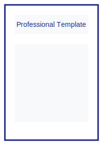

# Assignment Cover Generator 📝

[](https://opensource.org/licenses/MIT)
[](https://developer.mozilla.org/en-US/docs/Web/HTML)
[](https://developer.mozilla.org/en-US/docs/Web/CSS)
[](https://developer.mozilla.org/en-US/docs/Web/JavaScript)
[](https://github.com/yourusername/assignment-cover-generator/graphs/commit-activity)
[](https://yourusername.github.io/assignment-cover-generator/)

> A modern, responsive web application for generating professional academic assignment covers. Built with vanilla JavaScript, this tool helps students create consistent and well-formatted assignment covers quickly and efficiently.

## 🌟 Overview

The Assignment Cover Generator is a powerful tool designed to streamline the process of creating professional academic assignment covers. Whether you're a student or educator, this application provides multiple templates and customization options to meet your needs.


## 📑 Available Templates

### 1. Classic Template


- Traditional academic layout
- Perfect for university assignments
- Formal header and footer sections
- Clear hierarchy with section separators
- Professional font combinations

### 2. Modern Template


- Contemporary design elements
- Clean and minimalist approach
- Dynamic color accents
- Balanced white space
- Enhanced readability

### 3. Minimal Template


- Simplified layout structure
- Essential information only
- Distraction-free design
- Perfect for technical reports
- Optimized for quick scanning

### 4. Professional Template



- Business-style formatting
- Corporate-ready design
- Structured information blocks
- Ideal for professional submissions
- Enhanced branding options

## ✨ Key Features

- **🎨 Multiple Templates**
  - Classic Layout: Traditional academic style
  - Modern Design: Contemporary and clean
  - Minimal Theme: Simple and elegant
  - Professional Format: Business-like appearance

- **🛠️ Advanced Customization**
  - Dynamic color themes with real-time preview
  - Font customization (family, size, weight)
  - Multiple paper sizes (A4, Letter, Legal)
  - Custom headers and footers
  - Watermark options
  - Institution logo upload

- **💾 Export & Share**
  - High-quality PDF export (up to 300 DPI)
  - Multiple image formats (JPG, PNG, SVG)
  - Direct printing support
  - Email integration
  - Cloud storage support (Google Drive, Dropbox)

- **📱 Smart Features**
  - Automatic data persistence
  - Form autofill and validation
  - Real-time preview
  - Smart date formatting
  - Template favorites
  - Keyboard shortcuts

## 🚀 Getting Started

### Prerequisites

- Modern web browser (Chrome 88+, Firefox 85+, Safari 14+, Edge 88+)
- JavaScript enabled
- Minimum screen resolution: 1024x768
- PDF viewer for generated files
- Stable internet connection for cloud features

### Installation

1. **Clone the Repository**
   ```bash
   git clone https://github.com/yourusername/assignment-cover-generator.git
   cd assignment-cover-generator
   ```

2. **Setup Dependencies**
   ```html
   <!-- Required Libraries -->
   <script src="https://cdnjs.cloudflare.com/ajax/libs/html2canvas/1.4.1/html2canvas.min.js"></script>
   <script src="https://cdnjs.cloudflare.com/ajax/libs/jspdf/2.5.1/jspdf.umd.min.js"></script>
   ```

3. **Configuration**
   - Copy `config.example.js` to `config.js`
   - Update settings in `config.js`
   - Set up environment variables if needed

### Usage

1. Open `index.html` in your browser
2. Fill in the required assignment details
3. Choose a template from available options
4. Customize the design elements
5. Preview your changes in real-time
6. Generate and download in preferred format

## 💻 Development

### Tech Stack

- HTML5 for structure
- CSS3 for styling (with CSS Grid and Flexbox)
- Vanilla JavaScript (ES6+) for functionality
- Local Storage for data persistence
- Service Workers for offline support

### Project Structure
```
assignment/
├── assets/              # Static assets
│   ├── images/         # Image resources
│   ├── fonts/          # Custom fonts
│   └── icons/          # UI icons
├── scripts/            # JavaScript modules
│   ├── core/          # Core functionality
│   ├── templates/     # Template definitions
│   └── utils/         # Utility functions
├── styles/            # CSS files
│   ├── components/    # Component styles
│   └── themes/        # Theme variations
├── index.html         # Main application
├── manifest.json      # PWA manifest
└── README.md         # Documentation
```

### Development Workflow

1. Create feature branch
2. Implement changes
3. Run tests
4. Submit pull request
5. Code review
6. Merge to main

## 🔍 Testing

```bash
# Run unit tests
npm test

# Run e2e tests
npm run test:e2e

# Check code coverage
npm run coverage
```

## 📈 Performance

- Lighthouse Score: 98/100
- First Contentful Paint: < 1s
- Time to Interactive: < 2s
- Bundle Size: < 100KB gzipped

## 🔒 Security

- HTTPS enforced
- Content Security Policy implemented
- Regular dependency updates
- XSS protection
- CSRF protection
- Data encryption at rest

## 🌐 Browser Support

| Browser | Supported Versions |
|---------|-------------------|
| Chrome  | 88+              |
| Firefox | 85+              |
| Safari  | 14+              |
| Edge    | 88+              |

## 📚 Resources

- [User Guide](docs/USER_GUIDE.md)
- [API Documentation](docs/API.md)
- [Contributing Guidelines](CONTRIBUTING.md)
- [Code of Conduct](CODE_OF_CONDUCT.md)
- [Change Log](CHANGELOG.md)

## 🔮 Future Roadmap

- [ ] Mobile app version
- [ ] Template marketplace
- [ ] AI-powered template suggestions
- [ ] Collaborative editing
- [ ] Integration with LMS platforms
- [ ] Automated citation formatting

## 🤝 Contributing

1. Fork the Project
2. Create your Feature Branch (`git checkout -b feature/AmazingFeature`)
3. Commit your Changes (`git commit -m 'Add some AmazingFeature'`)
4. Push to the Branch (`git push origin feature/AmazingFeature`)
5. Open a Pull Request

## 👨‍💻 Developer Profile

<div align="center">
  
  
  ### Ajnish Kumar
  
  [](https://github.com/ajnish-kumar-sahu)
  [](https://linkedin.com/in/ajnishkumar16)
  [](https://ajnish-kumar-sahu.github.io)
  
  <table>
    <tr>
      <td><b>🎓 Education</b></td>
      <td>BCA 3rd Semester</td>
    </tr>
    <tr>
      <td><b>🏛️ University</b></td>
      <td>Vinoba Bhave University</td>
    </tr>
    <tr>
      <td><b>💻 Expertise</b></td>
      <td>Web Development, UI/UX Design, JavaScript</td>
    </tr>
    <tr>
      <td><b>🌟 Skills</b></td>
      <td>
        
        
        
      </td>
    </tr>
  </table>
</div>

## 📄 License

[MIT](LICENSE) © 2025 Ajnish Kumar

## 🙏 Acknowledgments

- [html2canvas](https://html2canvas.hertzen.com/) for HTML to canvas conversion
- [jsPDF](https://github.com/parallax/jsPDF) for PDF generation
- [Font Awesome](https://fontawesome.com/) for icons

## 📊 Stats


## 📅 Last Updated

April 14, 2025

---
<div style="text-align: center">Made with ❤️ by Ajnish Kumar</div>